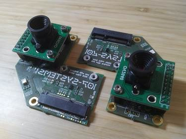
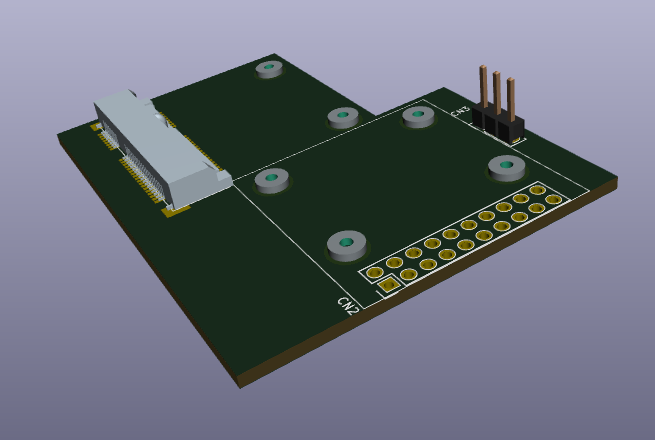
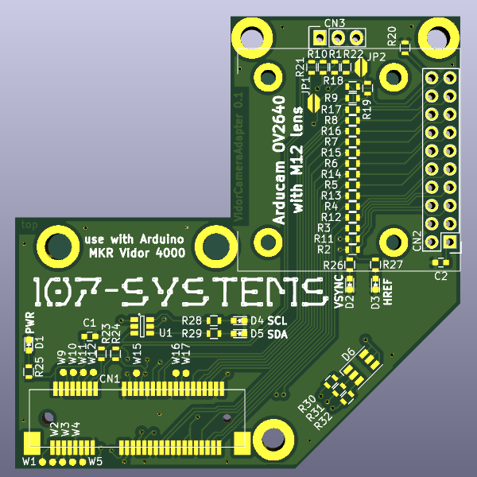
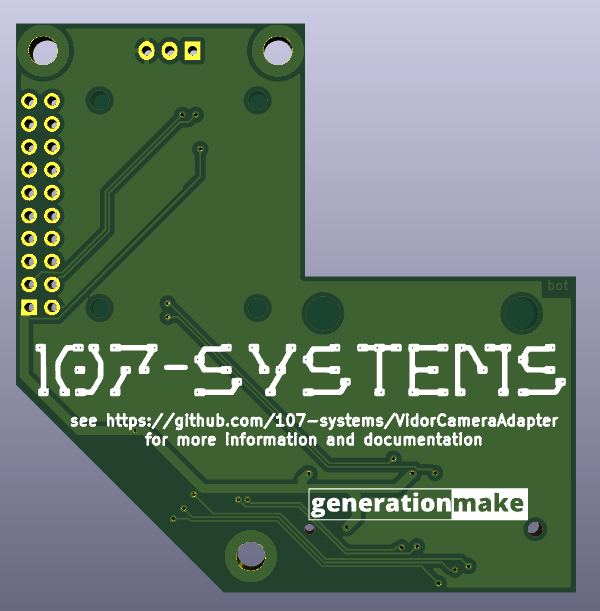

VidorCameraAdapter
==================

  

Adapter to connect a OV2640 camera module to the Mini PCIe connector of the Arduino MKR Vidor 4000.

## Pinout

This adapter uses only the pins of the Mini PCIe connector of the Arduino MKR Vidor (CN1).

| Pin Number  | Pin Name    | Signal | Description                                |
|:-----------:|:-----------:|:------:| ------------------------------------------ |
|  1 | WM.WM_PIO2 PEX_PIN1  | n.c.   | Connected to the WIFI NINA module on Vidor |
|  3 | WM.WM_PIO3 PEX_PIN3  | n.c.   | Connected to the WIFI NINA module on Vidor |
|  5 | WM.WM_PIO4 PEX_PIN5  | n.c.   | Connected to the WIFI NINA module on Vidor |
|  6 | PEX_PIN6             | LED_G  | RGB status LED (green)                     |
|  7 | WM.WM_PIO34 PEX_PIN7 | n.c.   | Connected to the WIFI NINA module on Vidor |
|  8 | PEX_PIN8             | LED_R  | RGB status LED (red)                       |
| 10 | PEX_PIN10            | SDA_V  | I2C to configure OV2640 module             |
| 11 | PEX_PIN11            | n.c.   | Reserved for future use                    |
| 12 | PEX_PIN12            | SCL_V  | I2C to configure OV2640 module             |
| 13 | PEX_PIN13            | DOUT6  | Data from OV2640 module                    |
| 14 | PEX_PIN14            | RST    | reset for OV2640 module                    |
| 16 | PEX_PIN16            | PWDN   | Power down for OV2640 module               |
| 17 | WM.WM_PIO24          | n.c.   | Connected to the WIFI NINA module on Vidor |
| 19 | WM.WM_PIO25          | n.c.   | Connected to the WIFI NINA module on Vidor |
| 20 | PEX_PIN20            | VSYNC  | Sync from OV2640 module                    |
| 22 | PEX_RST              | n.c.   | Pull up resistor on Vidor                  |
| 23 | PEX_PIN23            | PCLK   | Pixel clock from OV2640 module             |
| 25 | PEX_PIN25            | DOUT4  | Data from OV2640 module                    |
| 28 | PEX_PIN28            | HREF   | Sync from OV2640 module                    |
| 30 | PEX_PIN30            | n.c.   | Pull up resistor on Vidor                  |
| 31 | PEX_PIN31            | DOUT5  | Data from OV2640 module                    |
| 32 | PEX_PIN32            | n.c.   | Pull up resistor on Vidor                  |
| 33 | PEX_PIN33            | DOUT7  | Data from OV2640 module                    |
| 42 | PEX_PIN42            | DOUT0  | Data from OV2640 module                    |
| 44 | PEX_PIN44            | DOUT1  | Data from OV2640 module                    |
| 45 | PEX_PIN45            | LED_B  | RGB status LED (blue)                      |
| 46 | PEX_PIN46            | DOUT2  | Data from OV2640 module                    |
| 47 | PEX_PIN47            | XCLK   | Clock for OV2640 module                    |
| 48 | PEX_PIN48            | DOUT3  | Data from OV2640 module                    |
| 49 | PEX_PIN49            | DOUT8  | Data from OV2640 module                    |
| 51 | PEX_PIN51            | DOUT9  | Data from OV2640 module                    |

All GND pins are connected to the GND plane and all +3V3 pins are conntected to the +3V3-rail.

## PCB

### Top

### Bot

