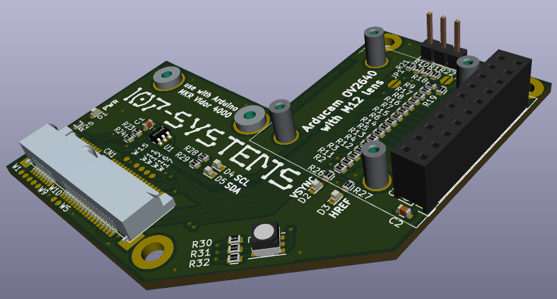
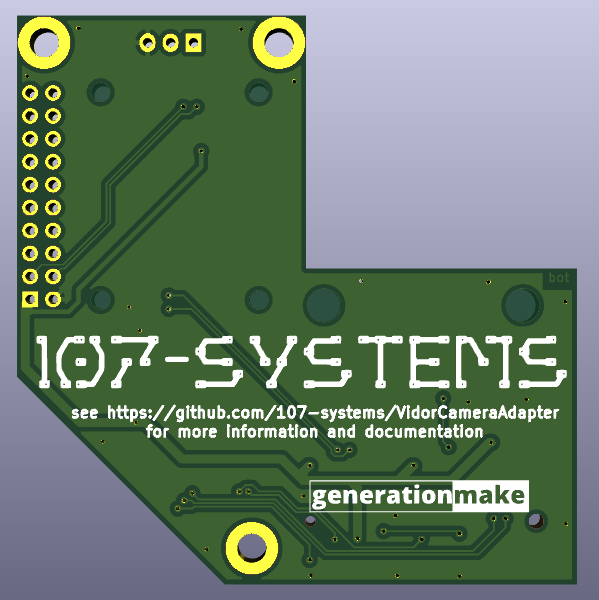

# VidorCameraAdapter
adapter to connect a OV2640 camera to the Mini PCIe connector of the Arduino MKR Vidor 4000

## Pinout

This adapter uses only the pins of the Mini PCIe connector of the Arduino MKR Vidor (CN1).

| pin number       | pin name | signal | description |
| -- | ----------- | - | - |
|  1 | WM.WM_PIO2 PEX_PIN1 | not connected | connected to the WIFI NINA module on Vidor |
|  3 | WM.WM_PIO3 PEX_PIN3 | not connected | connected to the WIFI NINA module on Vidor |
|  5 | WM.WM_PIO4 PEX_PIN5 | not connected | connected to the WIFI NINA module on Vidor |
|  6 | PEX_PIN6    | LED_G | RGB status LED (green) |
|  7 | WM.WM_PIO34 PEX_PIN7 | not connected | connected to the WIFI NINA module on Vidor |
|  8 | PEX_PIN8    | LED_R | RGB status LED (red) |
| 10 | PEX_PIN10   | SDA_V | I2C to configure OV2640 module |
| 11 | PEX_PIN11   | not connected | reserved for future use |
| 12 | PEX_PIN12   | SCL_V | I2C to configure OV2640 module |
| 13 | PEX_PIN13   | DOUT6 | data from OV2640 module |
| 14 | PEX_PIN14   | RST   | reset for OV2640 module |
| 16 | PEX_PIN16   | PWDN  | power down for OV2640 module |
| 17 | WM.WM_PIO24 | not connected | connected to the WIFI NINA module on Vidor |
| 19 | WM.WM_PIO25 | not connected | connected to the WIFI NINA module on Vidor |
| 20 | PEX_PIN20   | VSYNC | sync from OV2640 module |
| 22 | PEX_RST     | not connected | pull up resistor on Vidor |
| 23 | PEX_PIN23   | PCLK  | pixel clock from OV2640 module |
| 25 | PEX_PIN25   | DOUT4 | data from OV2640 module |
| 28 | PEX_PIN28   | HREF  | sync from OV2640 module |
| 30 | PEX_PIN30   | not connected | pull up resistor on Vidor |
| 31 | PEX_PIN31   | DOUT5 | data from OV2640 module |
| 32 | PEX_PIN32   | not connected | pull up resistor on Vidor |
| 33 | PEX_PIN33   | DOUT7 | data from OV2640 module |
| 42 | PEX_PIN42   | DOUT0 | data from OV2640 module |
| 44 | PEX_PIN44   | DOUT1 | data from OV2640 module |
| 45 | PEX_PIN45   | LED_B | RGB status LED (blue) |
| 46 | PEX_PIN46   | DOUT2 | data from OV2640 module |
| 47 | PEX_PIN47   | XCLK  | clock for OV2640 module |
| 48 | PEX_PIN48   | DOUT3 | data from OV2640 module |
| 49 | PEX_PIN49   | DOUT8 | data from OV2640 module |
| 51 | PEX_PIN51   | DOUT9 | data from OV2640 module |

All GND pins are connected to the GND plane and all +3V3 pins are conntected to the +3V3-rail.

## PCB

### Top

### Bot

